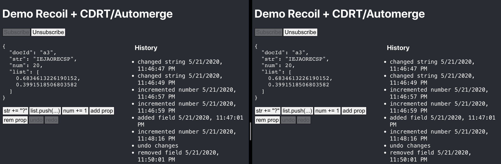

# Automerge/CRDT + Recoil Example

A Server and Client demonstrating [Automerge](https://github.com/automerge/automerge) over [WebSocket](https://github.com/automerge/automerge/issues/117) using the `Automerge.Connection` protocol.
Client side state management is based on [Recoil](https://recoiljs.org/).



## Dependencies

- Server:
  - [`ws`](https://github.com/websockets/ws)
  - [`automerge`](https://github.com/automerge/automerge)

- Client:
  - [`recoil`](https://recoiljs.org/)
  - [`automerge`](https://github.com/automerge/automerge)

# Run

```bash
lerna boostrap

# start server
nodemon --ext js packages/automerge-server-test

# start web client
cd packages/automerge-web
yarn
yarn start

# start cli client
node packages/automerge-client-test
> s a5      # subscribe to 'a5'
> c a5 x 6  # change property 'x' to 6 in document 'a5'
> p a6      # print document 'a5
```

# Issues

-  Unsubscribe does not work currently

# Questions

- How big can documents get until we run into problems?
- Why is the history not computed on demand?
- Why does undo not work after reload? (actorId?)
- How to incrementally persist data on the sever?

# TODO

- User IDs / user colors
- Presence
- Focus tracking
- "push --force" on click
- UI fields
- Simualte offline by blocking socket
- Client side persistance
- Doc list as atom
- Offline support
